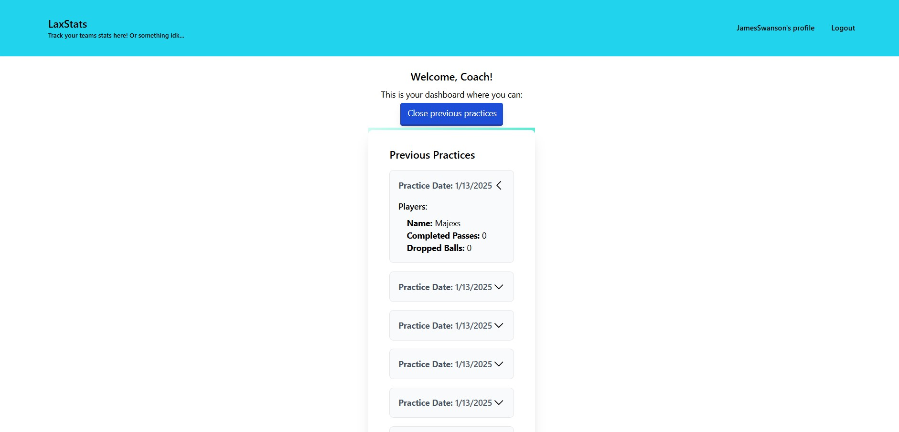

  https://opensource.org/license/mit
# LaxStats - A Stat-Tracking App
## Description
This full-stack MERN app allows lacrosse coaches & players to keep track of various stats across multiple practices to track the team's progress. It is the 3rd unit project for the Columbia EdX Coding Bootcamp, using MongoDB as the database to store data, Express.js as an API & back-end framework, React as an interactive user-friendly front-end framework, & Node.js as a server environment to connect the front-end with the database.
## Table of Contents
* [Installation](#installation)
* [Usage](#usage)
* [Credits](#credits)
* [License](#license)
* [Features](#features)
* [Contributing](#contributing)
## Installation
The repo can be downloaded locally and edited, but a live site has also been deployed: https://laxstats.onrender.com/login
For local use, one will need to run 'npm install', 'npm run build', and finally 'npm run start:dev.'
Note, however that this app also requires certain dependencies, such as 'dayjs', 'main', and 'tailwinds', but also a number of devDependencies such as 'autoprefixer', 'concurrently', 'postcss', 'tailwinds', & 'wait-on.' 
## Usage
On the website, users can sign up as either a coach or a player. Once they log in, they'll be presented with a unique dashboard to see a display of stats. As a coach, the user can create a new practice and keep track of every player's Completed Passes & Dropped Balls. This data is then stored in a database for later reference. As a player, a user can view their performance in each practice by hovering over the practice card. 
A demo video has been included below, as well as a number of screenshots of the app's functionality:

## Credits
This project has been collectively developed by Shannon Mastrogiovanni, Shuki Kathuria, James Swanson, & Chat "Snoop Dogg" GPT. Emails and GitHub repos are included below.
## License
This project is licensed under the terms of the MIT License.
## Features
While this project has achieved MVP, there are features both interactable and aesthetic that can still be included. Such examples include continued color coordination, stat aggregates & averages, goal-setters, editing & deleting practices, game tracking, providing more stats to track over time, and potentially a retrofit for other sports/recreations. As this project has high scalability, such additions & modifications will require only marginal adjustment.
## Contributing
Download the repo locally and add any features that you'd find useful - just be sure to give proper credit!

## Questions
Have questions? Visit [the LaxStat GitHub repo](https://github.com/shannonMG/LaxStats), our personal GitHub repos at [shukikat](https://github.com/shukikat), [shannonMG](https://github.com/shannonMG), & [Majexs](https://github.com/Majexs) or email us at [kathuriashuki@gmail.com](mailto:kathuriashuki@gmail.com), [shannonmastrogiovanni@gmail.com](mailto:shannonmastrogiovanni@gmail.com), & [majexs@gmail.com](mailto:majexs@gmail.com).